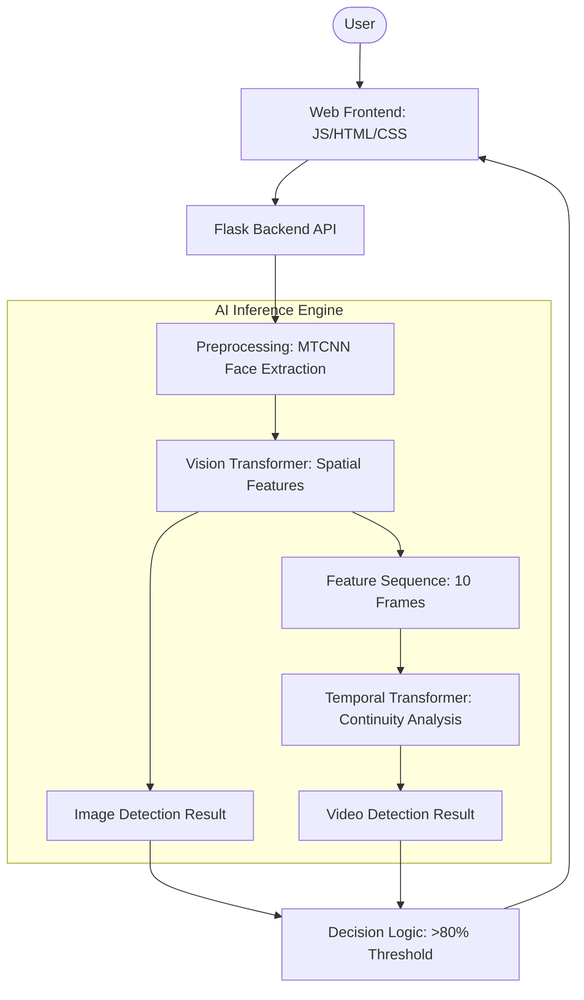
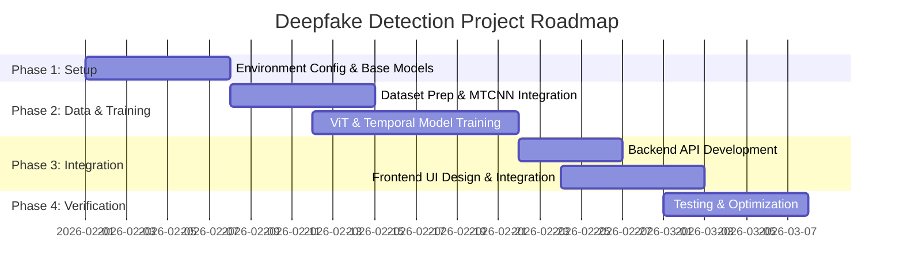

# Deepfake Detection System - Technical Documentation

## 1. Proposed Methodology
The proposed system addresses the challenge of identifying manipulated media (images and videos) using an ensemble-inspired hierarchy of Vision Transformers (ViT) and Temporal Transformers.

### Overall Approach
1.  **Media Acquisition**: The system accepts high-resolution images and videos via a user-friendly web interface.
2.  **Preprocessing & Face Extraction**: To focus the AI on the most critical evidence, we employ **MTCNN (Multi-task Cascaded Convolutional Networks)** to detect and crop facial regions. This reduces background noise and computational overhead.
3.  **Spatial Analysis (ViT-Base)**: Each facial crop is processed by a **Vision Transformer (ViT-Base/16)**. Unlike traditional CNNs, ViT uses self-attention mechanisms to capture global spatial dependencies and subtle pixel inconsistencies characteristic of GAN or Diffusion-based manipulations.
4.  **Temporal Analysis (Temporal Transformer)**: For videos, the feature embeddings from 10 sampled frames are fed into a **Temporal Transformer Encoder**. This module analyzes the consistency of facial movements and artifacts across time (e.g., unnatural blinking or micro-jitter).
5.  **Decision Logic**: A conservative classification threshold (80% confidence) is applied to minimize false positives, a critical requirement for forensic applications.

---

## 2. System Design & Architecture

### System Architecture Diagram

### Block Diagram (Data Flow)

---

## 3. Algorithms & Techniques

| Component | Algorithm / Technique | Purpose |
| :--- | :--- | :--- |
| **Face Detection** | MTCNN (Multi-task Cascaded CNN) | Detects landmarks and crops faces from high-res media. |
| **Spatial Model** | Vision Transformer (ViT-B/16) | Captures long-range pixel correlations using self-attention. |
| **Temporal Model** | Transformer Encoder (4 Layers) | Analyzes frame-to-frame consistency and temporal artifacts. |
| **Optimization** | AdamW Optimizer | Stable training for Transformer-based architectures. |
| **Loss Function** | Cross-Entropy Loss | Standard for multi-class (Real vs. Fake) classification. |
| **Augmentation** | Albumentations | JPEG compression, Gaussian noise, and flipping to improve robustness. |

---

## 4. Tools & Technologies
-   **Core ML**: PyTorch, TorchVision
-   **Model Libraries**: `timm` (PyTorch Image Models), `facenet-pytorch`
-   **Backend**: Flask (Python)
-   **Frontend**: Vanilla JavaScript, CSS3 (Glassmorphism design), HTML5
-   **Data Processing**: OpenCV (Video sampling), NumPy, PIL
-   **Development**: Python 3.11+, Git

---

## 5. Work Plan & Timeline (4-Week Schedule)

### 4-Week Gantt Chart

### Detailed Timeline breakdown
-   **Week 1: Research & Setup**
    -   Define requirements and hardware setup (CUDA).
    -   Initialize ViT-Base and Temporal Transformer architectures.
    -   Develop MTCNN-based face extraction pipeline.
-   **Week 2: Data Pipeline & Spatial Training**
    -   Pre-process datasets (FFPP, Celeb-DF).
    -   Train/Fine-tune ViT on individual frames.
    -   Implement data augmentation strategies.
-   **Week 3: Temporal Analysis & API**
    -   Extract frame sequences for temporal training.
    -   Train the Temporal Transformer on ViT embeddings.
    -   Develop Flask API endpoints for Image/Video prediction.
-   **Week 4: Frontend Development & Deployment**
    -   Build the "VisionShield" modern web interface.
    -   Integrate frontend with backend APIs.
    -   Verify with real-world samples and finalize the >80% confidence logic.
